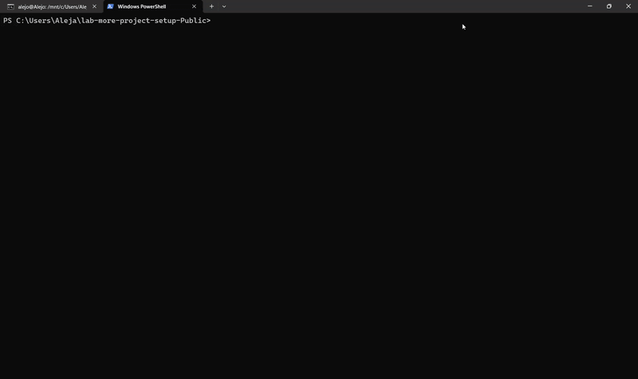

# Command-Line AI Agent with Tool Integration


This project provides a command-line chat agent that integrates with a language model and supports tool-based interactions for file operations and calculations. Users can interact using natural language or explicit slash commands, with tab completion enhancing usability and efficiency.

## Requirements

- Must be run from inside a git repository. If no `.git` folder is found, the program prints an error and exits.
- If an `AGENTS.md` file is present in the current directory, it is automatically loaded into the conversation at startup. This file provides project-specific instructions for the agent — see [agents.md](https://agents.md/) for the convention.

## Installation

Clone the repository and install the package:

```bash
$ pip install .
```

Set your API keys depending on the provider:

```bash
$ export GROQ_API_KEY=your_key_here
$ export OPENROUTER_API_KEY=your_key_here
```

## Usage

Run the agent in interactive mode:

```bash
$ chat
chat> what files are in the .github folder?
The only file in this folder be the workflows subfolder, arr!
```

You can pass a message directly:

```bash
$ chat "what files are in the .github folder?"
The only file in this folder be the workflows subfolder, arr!
```

Specify which model provider to use:

```bash
$ chat --provider openai
chat> What model are you?
I be GPT-4o, provided by OpenAI, arr!
```

Supported providers:
- `groq` (default)
- `openai`
- `anthropic`
- `google`

### Debug Mode

Debug mode prints the tool name and arguments each time the LLM invokes a tool.

```bash
$ chat --debug
chat> what files are in the .github folder?
[tool] /ls {".github"}
The only file in this folder be the workflows subfolder, arr!
```

### Slash Commands

Slash commands run tools directly without an LLM call, giving instant deterministic output. Tab completion is supported.

```bash
chat> /ls .github
workflows

chat> /cat README.md
# Command-Line AI Agent with Tool Integration
...

chat> /calculate 2**10
{"result": 1024}

chat> /grep import chat.py
import argparse
import os
...

chat> /help
Available commands: /help, /ls, /cat <file>, /grep <pattern> <path>, /calculate <expression>, /compact, /doctests <file>, /rm <path>, /pip_install <library>, /load_image <path>
```

## Example Queries on Projects

The following examples demonstrate the agent analyzing real codebases using its file tools.

### Markdown Compiler

This example demonstrates how the chat tool can analyze a codebase by searching for specific patterns across files.

```bash
cd test_projects/Markdown-to-HTML-compiler
chat
chat> does this project use regular expressions?
No. I grepped the project files and did not find any use of the `re` library.
```

This example is useful because it demonstrates how the agent uses the grep tool to analyze code structure across files.

### Ebay Scraper

This example demonstrates how the agent can summarize a project and answer higher-level questions about its purpose and implications.

```bash
cd test_projects/Ebay_webscrapping
chat
chat> tell me about this project
The project be designed to scrape product information from eBay listings, arr!

chat> is this legal?
In general, scraping public webpages be often legal, although using an official API be usually more reliable and efficient.
```

This example is useful because it shows the agent can summarize a project and reason about broader implications.

### Personal Website

This example demonstrates how the tool can interpret and summarize the contents of a non-Python project.

```bash
cd test_projects/abedoya-norena.github.io
chat
chat> what does this project contain?
This project contains the files for a personal website, including HTML and related assets.
```

This example is useful because it demonstrates that the agent can interpret non-Python projects using file inspection.

## Text-to-Speech

Pass `--tts` to have every response read aloud using the Groq TTS API.
An optional `--voice` flag selects the voice (default: `daniel`).

```
$ chat --tts
chat> What is 2 + 2?
The answer be 4, arr!    ← printed and spoken aloud
```

```
$ chat --tts --voice hannah
chat> Tell me a pirate joke
Why be pirates called pirates? Because they ARRRR!
```

Available voices: `daniel`, `troy`, `austin`, `hannah`, `diana`, `autumn`. See [Groq TTS docs](https://console.groq.com/docs/text-to-speech/orpheus) for details.

Playback requires `sounddevice` and `soundfile` (`pip install sounddevice soundfile`).
On Linux you may also need `sudo apt-get install libportaudio2`.

The demo below shows a full TTS session — every response is read aloud automatically.


## Speech-to-Text (Voice Input)

Pass `--stt` to speak your questions instead of typing them.

```
$ chat --stt
chat> [Hold SPACE to speak]   ← hold spacebar
chat> [● recording...]        ← recording in progress
chat> [transcribing...]       ← Groq Whisper processing
chat> what is the capital of France?
The capital of France be Paris, arr!
```

Combine with `--tts` for a fully voice-driven conversation:

```
$ chat --stt --tts
chat> [Hold SPACE to speak]
```

Hold SPACE → speak → release → Whisper transcribes → LLM responds → TTS reads the answer aloud.

Requires `sounddevice`, `soundfile`, `numpy`, and `pynput` (all in `requirements.txt`).
On Linux you may also need `sudo apt-get install libportaudio2`.

### Trigger-word mode (always-on)

Pass `--trigger "hey chat"` (or any phrase you prefer) for hands-free operation.
The microphone is always open, but Groq Whisper is only called when actual speech is
detected — silence is filtered out locally using energy-based voice activity detection
so API costs stay low.

```
$ chat --trigger "hey chat" --tts
[listening for 'hey chat'...]
                                    ← say nothing, no API calls
hey chat, what time is it?          ← trigger detected
chat> [● triggered! speak your query...]
what is the weather like?           ← query captured
chat> I cannot check live weather, arr, but I can help with other tasks!
                                    ← answer also spoken aloud
[listening for 'hey chat'...]       ← back to listening
```

You can use any trigger phrase:

```
$ chat --trigger "okay docchat"
```

The demo below shows trigger-word detection followed by Whisper transcription and a spoken reply.



## Autonomous Markdown Compiler

The agent autonomously completed a [Markdown-to-HTML compiler](https://github.com/abedoya-norena/Markdown-to-HTML-compiler/tree/agents) on a dedicated branch containing only commits from the AI agent (all prefixed with `[docchat]`).

The branch can be found here: **https://github.com/abedoya-norena/Markdown-to-HTML-compiler/tree/agents**

The agent used the `write_file` tool to implement all required functions from scratch:

- `compile_headers` — converts `#` markdown headers to `<h1>`–`<h6>` tags
- `compile_italic_star` / `compile_italic_underscore` — converts `*italic*` and `_italic_` to `<i>`
- `compile_bold_stars` / `compile_bold_underscore` — converts `**bold**` and `__bold__` to `<b>`
- `compile_strikethrough` — converts `~~text~~` to `<ins>`
- `compile_code_inline` — converts backtick code spans to `<code>`, escaping `<` and `>`
- `compile_links` — converts `[text](url)` to `<a>` tags
- `compile_images` — converts `` to `` tags

It also implemented `convert_file` in `__main__.py`, fixed the CI workflows (doctests, command-line, flake8), and updated all badge URLs — all autonomously without any human code edits.

## Agent Examples: File Operations and Git History

The examples below demonstrate that docchat can create, modify, and delete files, and that each change is automatically committed to git.

### Creating a file

The session below shows docchat generating a new Python utility and committing it to the repo — the file does not exist beforehand and appears in `git log` afterward.

```
$ ls -a
.git  AGENTS.md  README.md  chat.py

$ git log --oneline
4a1f832 (HEAD -> agents) init commit

$ chat
chat> Write a Python script called greet.py that prints "Hello, World!" and commit it
I used the write_file tool to create greet.py with a simple print statement and committed it to git.
chat> ^C

$ ls -a
.git  AGENTS.md  README.md  chat.py  greet.py

$ cat greet.py
print("Hello, World!")

$ git log --oneline
9c3e21b (HEAD -> agents) [docchat] add greet.py with hello world print
4a1f832 init commit
```

### Modifying a file

The session below shows docchat updating an existing file in place and committing the change — `git log` reflects the new commit and `cat` confirms the new content.

```
$ cat greet.py
print("Hello, World!")

$ git log --oneline
9c3e21b (HEAD -> agents) [docchat] add greet.py with hello world print
4a1f832 init commit

$ chat
chat> Update greet.py so it asks for the user's name and greets them personally
I updated greet.py to use input() to read the user's name and greet them, then committed the change.
chat> ^C

$ cat greet.py
name = input("What is your name? ")
print(f"Hello, {name}!")

$ git log --oneline
b72fd04 (HEAD -> agents) [docchat] update greet.py to greet user by name
9c3e21b [docchat] add greet.py with hello world print
4a1f832 init commit
```

### Deleting a file

The session below shows docchat removing a file and committing the deletion — the file is gone from the working tree and `git log` records the removal.

```
$ ls -a
.git  AGENTS.md  README.md  chat.py  greet.py  old_notes.txt

$ git log --oneline
b72fd04 (HEAD -> agents) [docchat] update greet.py to greet user by name
9c3e21b [docchat] add greet.py with hello world print
4a1f832 init commit

$ chat
chat> Delete old_notes.txt, it is no longer needed
I removed old_notes.txt using the rm tool and committed the deletion.
chat> ^C

$ ls -a
.git  AGENTS.md  README.md  chat.py  greet.py

$ git log --oneline
e105a3c (HEAD -> agents) [docchat] rm old_notes.txt
b72fd04 [docchat] update greet.py to greet user by name
9c3e21b [docchat] add greet.py with hello world print
4a1f832 init commit
```
